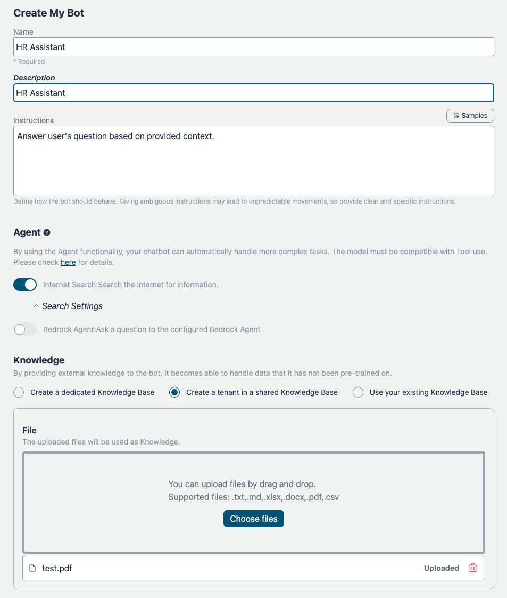
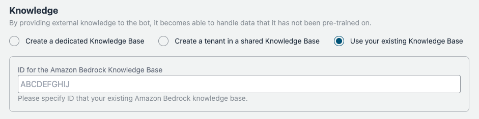
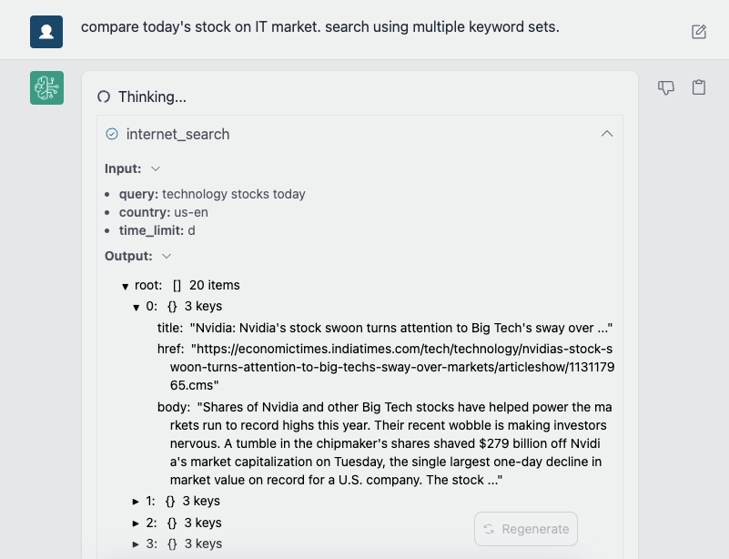
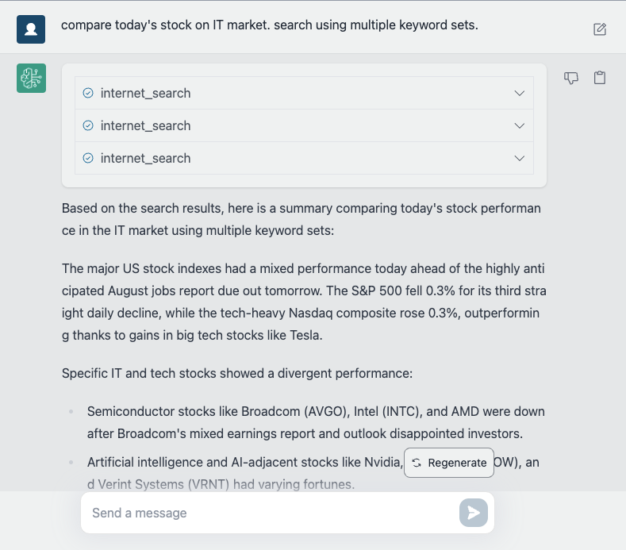
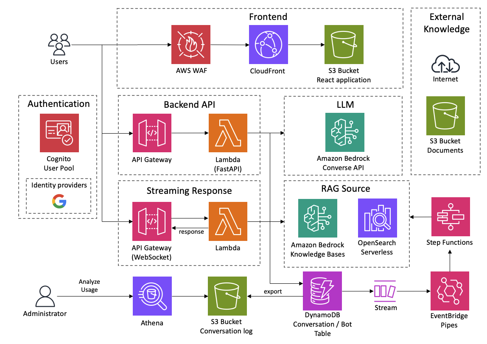

<h1 align="center">Bedrock Chat (BrChat)</h1>

<p align="center">
  
  
  
  <a href="https://github.com/aws-samples/bedrock-chat/issues?q=is%3Aissue%20state%3Aopen%20label%3Aroadmap">
    
  </a>
</p>

[English](https://github.com/aws-samples/bedrock-chat/blob/v3/README.md) | [日本語](https://github.com/aws-samples/bedrock-chat/blob/v3/docs/README_ja-JP.md) | [한국어](https://github.com/aws-samples/bedrock-chat/blob/v3/docs/README_ko-KR.md) | [中文](https://github.com/aws-samples/bedrock-chat/blob/v3/docs/README_zh-CN.md) | [Français](https://github.com/aws-samples/bedrock-chat/blob/v3/docs/README_fr-FR.md) | [Deutsch](https://github.com/aws-samples/bedrock-chat/blob/v3/docs/README_de-DE.md) | [Español](https://github.com/aws-samples/bedrock-chat/blob/v3/docs/README_es-ES.md) | [Italian](https://github.com/aws-samples/bedrock-chat/blob/v3/docs/README_it-IT.md) | [Norsk](https://github.com/aws-samples/bedrock-chat/blob/v3/docs/README_nb-NO.md) | [ไทย](https://github.com/aws-samples/bedrock-chat/blob/v3/docs/README_th-TH.md) | [Bahasa Indonesia](https://github.com/aws-samples/bedrock-chat/blob/v3/docs/README_id-ID.md) | [Bahasa Melayu](https://github.com/aws-samples/bedrock-chat/blob/v3/docs/README_ms-MY.md) | [Tiếng Việt](https://github.com/aws-samples/bedrock-chat/blob/v3/docs/README_vi-VN.md) | [Polski](https://github.com/aws-samples/bedrock-chat/blob/v3/docs/README_pl-PL.md) | [Português Brasil](https://github.com/aws-samples/bedrock-chat/blob/v3/docs/README_pt-BR.md)


En flerspråklig generativ AI-plattform drevet av [Amazon Bedrock](https://aws.amazon.com/bedrock/).
Støtter chat, tilpassede boter med kunnskap (RAG), botdeling via en botbutikk, og automatisering av oppgaver ved hjelp av agenter.


> [!Warning]
>
> **V3 er utgitt. For å oppdatere, vennligst gjennomgå nøye [migreringsguiden](./migration/V2_TO_V3_nb-NO.md).** Uten forsiktighet vil **BOTER FRA V2 BLI UBRUKELIGE.**

### Bot-tilpasning / Bot-butikk

Legg til dine egne instruksjoner og kunnskap (også kjent som [RAG](https://aws.amazon.com/what-is/retrieval-augmented-generation/). Boten kan deles blant applikasjonsbrukere via bot-butikkens markedsplass. Den tilpassede boten kan også publiseres som et frittstående API (Se [detaljer](./PUBLISH_API_nb-NO.md)).

<details>
<summary>Skjermbilder</summary>




Du kan også importere eksisterende [Amazon Bedrock's KnowledgeBase](https://aws.amazon.com/bedrock/knowledge-bases/).



</details>

> [!Important]
> Av styringsmessige årsaker kan bare tillatte brukere opprette tilpassede boter. For å tillate opprettelse av tilpassede boter, må brukeren være medlem av gruppen kalt `CreatingBotAllowed`, som kan settes opp via administrasjonskonsollen > Amazon Cognito User pools eller aws cli. Merk at brukergruppe-ID-en kan refereres ved å gå til CloudFormation > BedrockChatStack > Outputs > `AuthUserPoolIdxxxx`.

### Administrative funksjoner

API-administrasjon, Merk boter som essensielle, Analyser bruk av boter. [detaljer](./ADMINISTRATOR_nb-NO.md)

<details>
<summary>Skjermbilder</summary>


)

</details>

### Agent

Ved å bruke [Agent-funksjonaliteten](./AGENT_nb-NO.md), kan chatboten din automatisk håndtere mer komplekse oppgaver. For eksempel, for å svare på et brukersspørsmål, kan Agenten hente nødvendig informasjon fra eksterne verktøy eller bryte ned oppgaven i flere trinn for behandling.

<details>
<summary>Skjermbilder</summary>




</details>

## 🚀 Superenkel Distribusjon

- I us-east-1-regionen, åpne [Bedrock Model access](https://us-east-1.console.aws.amazon.com/bedrock/home?region=us-east-1#/modelaccess) > `Manage model access` > Merk av for alle modellene du ønsker å bruke og klikk deretter `Save changes`.

<details>
<summary>Skjermbilde</summary>


</details>

### Støttede regioner

Sørg for at du distribuerer Bedrock Chat i en region [hvor OpenSearch Serverless og Ingestion APIs er tilgjengelig](https://docs.aws.amazon.com/general/latest/gr/opensearch-service.html), hvis du ønsker å bruke bots og opprette kunnskapsbaser (OpenSearch Serverless er standardvalget). Per august 2025 støttes følgende regioner: us-east-1, us-east-2, us-west-1, us-west-2, ap-south-1, ap-northeast-1, ap-northeast-2, ap-southeast-1, ap-southeast-2, ca-central-1, eu-central-1, eu-west-1, eu-west-2, eu-south-2, eu-north-1, sa-east-1

For parameteren **bedrock-region** må du velge en region [hvor Bedrock er tilgjengelig](https://docs.aws.amazon.com/general/latest/gr/bedrock.html).

- Åpne [CloudShell](https://console.aws.amazon.com/cloudshell/home) i regionen hvor du ønsker å distribuere
- Kjør distribusjonen via følgende kommandoer. Hvis du ønsker å spesifisere versjonen som skal distribueres eller trenger å anvende sikkerhetspolicyer, vennligst spesifiser de aktuelle parametrene fra [Valgfrie Parametere](#optional-parameters).

```sh
git clone https://github.com/aws-samples/bedrock-chat.git
cd bedrock-chat
chmod +x bin.sh
./bin.sh
```

- Du vil bli spurt om du er en ny bruker eller bruker v3. Hvis du ikke er en fortsettende bruker fra v0, vennligst skriv inn `y`.

### Valgfrie Parametere

Du kan spesifisere følgende parametere under distribusjon for å forbedre sikkerhet og tilpasning:

- **--disable-self-register**: Deaktiver selvregistrering (standard: aktivert). Hvis dette flagget er satt, må du opprette alle brukere på cognito og det vil ikke tillate brukere å selvregistrere kontoene sine.
- **--enable-lambda-snapstart**: Aktiver [Lambda SnapStart](https://docs.aws.amazon.com/lambda/latest/dg/snapstart.html) (standard: deaktivert). Hvis dette flagget er satt, forbedrer det kaldstarttider for Lambda-funksjoner, som gir raskere responstider for bedre brukeropplevelse.
- **--ipv4-ranges**: Kommaseparert liste over tillatte IPv4-områder. (standard: tillat alle ipv4-adresser)
- **--ipv6-ranges**: Kommaseparert liste over tillatte IPv6-områder. (standard: tillat alle ipv6-adresser)
- **--disable-ipv6**: Deaktiver tilkoblinger over IPv6. (standard: aktivert)
- **--allowed-signup-email-domains**: Kommaseparert liste over tillatte e-postdomener for registrering. (standard: ingen domenebegrensning)
- **--bedrock-region**: Definer regionen hvor bedrock er tilgjengelig. (standard: us-east-1)
- **--repo-url**: Det tilpassede repositoriet for Bedrock Chat som skal distribueres, hvis forket eller tilpasset kildekontroll. (standard: https://github.com/aws-samples/bedrock-chat.git)
- **--version**: Versjonen av Bedrock Chat som skal distribueres. (standard: siste versjon under utvikling)
- **--cdk-json-override**: Du kan overstyre CDK-kontekstverdier under distribusjon ved å bruke override JSON-blokken. Dette lar deg endre konfigurasjonen uten å redigere cdk.json-filen direkte.

Eksempel på bruk:

```bash
./bin.sh --cdk-json-override '{
  "context": {
    "selfSignUpEnabled": false,
    "enableLambdaSnapStart": true,
    "allowedIpV4AddressRanges": ["192.168.1.0/24"],
    "allowedCountries": ["US", "CA"],
    "allowedSignUpEmailDomains": ["example.com"],
    "globalAvailableModels": [
      "claude-v3.7-sonnet",
      "claude-v3.5-sonnet",
      "amazon-nova-pro",
      "amazon-nova-lite",
      "llama3-3-70b-instruct"
    ]
  }
}'
```

Override JSON må følge samme struktur som cdk.json. Du kan overstyre alle kontekstverdier inkludert:

- `selfSignUpEnabled`
- `enableLambdaSnapStart`
- `allowedIpV4AddressRanges`
- `allowedIpV6AddressRanges`
- `allowedCountries`
- `allowedSignUpEmailDomains`
- `bedrockRegion`
- `enableRagReplicas`
- `enableBedrockCrossRegionInference`
- `globalAvailableModels`: aksepterer en liste over modell-IDer som skal aktiveres. Standardverdien er en tom liste, som aktiverer alle modeller.
- `logoPath`: relativ sti til logo-ressursen i frontend `public/`-katalogen som vises øverst i navigasjonsskuffen.
- Og andre kontekstverdier definert i cdk.json

> [!Note]
> Override-verdiene vil bli slått sammen med den eksisterende cdk.json-konfigurasjonen under distribusjonstiden i AWS code build. Verdier spesifisert i override vil ha forrang over verdiene i cdk.json.

#### Eksempel på kommando med parametere:

```sh
./bin.sh --disable-self-register --ipv4-ranges "192.0.2.0/25,192.0.2.128/25" --ipv6-ranges "2001:db8:1:2::/64,2001:db8:1:3::/64" --allowed-signup-email-domains "example.com,anotherexample.com" --bedrock-region "us-west-2" --version "v1.2.6"
```

- Etter omtrent 35 minutter vil du få følgende utdata, som du kan få tilgang til fra nettleseren din

```
Frontend URL: https://xxxxxxxxx.cloudfront.net
```


Registreringsskjermen vil vises som vist ovenfor, hvor du kan registrere e-postadressen din og logge inn.

> [!Important]
> Uten å sette den valgfrie parameteren, tillater denne distribusjonsmetoden at alle som kjenner URL-en kan registrere seg. For produksjonsbruk anbefales det sterkt å legge til IP-adressebegrensninger og deaktivere selvregistrering for å redusere sikkerhetsrisikoer (du kan definere allowed-signup-email-domains for å begrense brukere slik at kun e-postadresser fra selskapets domene kan registrere seg). Bruk både ipv4-ranges og ipv6-ranges for IP-adressebegrensninger, og deaktiver selvregistrering ved å bruke disable-self-register når du kjører ./bin.

> [!TIP]
> Hvis `Frontend URL` ikke vises eller Bedrock Chat ikke fungerer som det skal, kan det være et problem med den nyeste versjonen. I dette tilfellet, legg til `--version "v3.0.0"` til parametrene og prøv distribusjonen på nytt.

## Arkitektur

Dette er en arkitektur bygget på AWS-administrerte tjenester, som eliminerer behovet for infrastrukturhåndtering. Ved å bruke Amazon Bedrock er det ikke behov for å kommunisere med APIer utenfor AWS. Dette muliggjør utrulling av skalerbare, pålitelige og sikre applikasjoner.

- [Amazon DynamoDB](https://aws.amazon.com/dynamodb/): NoSQL-database for lagring av samtalehistorikk
- [Amazon API Gateway](https://aws.amazon.com/api-gateway/) + [AWS Lambda](https://aws.amazon.com/lambda/): Backend API-endepunkt ([AWS Lambda Web Adapter](https://github.com/awslabs/aws-lambda-web-adapter), [FastAPI](https://fastapi.tiangolo.com/))
- [Amazon CloudFront](https://aws.amazon.com/cloudfront/) + [S3](https://aws.amazon.com/s3/): Frontend-applikasjonsleveranse ([React](https://react.dev/), [Tailwind CSS](https://tailwindcss.com/))
- [AWS WAF](https://aws.amazon.com/waf/): IP-adressebegrensning
- [Amazon Cognito](https://aws.amazon.com/cognito/): Brukerautentisering
- [Amazon Bedrock](https://aws.amazon.com/bedrock/): Administrert tjeneste for å utnytte grunnleggende modeller via APIer
- [Amazon Bedrock Knowledge Bases](https://aws.amazon.com/bedrock/knowledge-bases/): Tilbyr et administrert grensesnitt for Retrieval-Augmented Generation ([RAG](https://aws.amazon.com/what-is/retrieval-augmented-generation/)), med tjenester for innbygging og parsing av dokumenter
- [Amazon EventBridge Pipes](https://aws.amazon.com/eventbridge/pipes/): Mottar hendelser fra DynamoDB-strøm og starter Step Functions for å integrere ekstern kunnskap
- [AWS Step Functions](https://aws.amazon.com/step-functions/): Orkestrerer innhentingsprosessen for å integrere ekstern kunnskap i Bedrock Knowledge Bases
- [Amazon OpenSearch Serverless](https://aws.amazon.com/opensearch-service/features/serverless/): Fungerer som backend-database for Bedrock Knowledge Bases, tilbyr fulltekstsøk og vektorsøkfunksjoner, som muliggjør nøyaktig gjenfinning av relevant informasjon
- [Amazon Athena](https://aws.amazon.com/athena/): Spørringstjeneste for å analysere S3-bøtter



## Distribuer med CDK

Super-enkel distribusjon bruker [AWS CodeBuild](https://aws.amazon.com/codebuild/) for å utføre distribusjon med CDK internt. Denne delen beskriver prosedyren for å distribuere direkte med CDK.

- Du må ha UNIX, Docker og et Node.js-kjøretidsmiljø.

> [!Important]
> Hvis det er utilstrekkelig lagringsplass i det lokale miljøet under distribusjon, kan CDK-bootstrapping resultere i en feil. Vi anbefaler å utvide volumstørrelsen på instansen før distribusjon.

- Klon dette repositoriet

```
git clone https://github.com/aws-samples/bedrock-chat
```

- Installer npm-pakker

```
cd bedrock-chat
cd cdk
npm ci
```

- Om nødvendig, rediger følgende oppføringer i [cdk.json](./cdk/cdk.json).

  - `bedrockRegion`: Region hvor Bedrock er tilgjengelig. **MERK: Bedrock støtter IKKE alle regioner foreløpig.**
  - `allowedIpV4AddressRanges`, `allowedIpV6AddressRanges`: Tillatt IP-adresseområde.
  - `enableLambdaSnapStart`: Standard er true. Sett til false hvis du distribuerer til en [region som ikke støtter Lambda SnapStart for Python-funksjoner](https://docs.aws.amazon.com/lambda/latest/dg/snapstart.html#snapstart-supported-regions).
  - `globalAvailableModels`: Standard er alle. Hvis angitt (liste over modell-IDer), lar det deg globalt kontrollere hvilke modeller som vises i nedtrekksmenyene på tvers av chatter for alle brukere og under bot-opprettelse i Bedrock Chat-applikasjonen.
  - `logoPath`: Relativ sti under `frontend/public` som peker til bildet som vises øverst i applikasjonsskuffen.
Følgende modell-IDer støttes (sørg for at de også er aktivert i Bedrock-konsollen under Modelltilgang i din distribusjonsregion):
- **Claude-modeller:** `claude-v4-opus`, `claude-v4.1-opus`, `claude-v4-sonnet`, `claude-v3.5-sonnet`, `claude-v3.5-sonnet-v2`, `claude-v3.7-sonnet`, `claude-v3.5-haiku`, `claude-v3-haiku`, `claude-v3-opus`
- **Amazon Nova-modeller:** `amazon-nova-pro`, `amazon-nova-lite`, `amazon-nova-micro`
- **Mistral-modeller:** `mistral-7b-instruct`, `mixtral-8x7b-instruct`, `mistral-large`, `mistral-large-2`
- **DeepSeek-modeller:** `deepseek-r1`
- **Meta Llama-modeller:** `llama3-3-70b-instruct`, `llama3-2-1b-instruct`, `llama3-2-3b-instruct`, `llama3-2-11b-instruct`, `llama3-2-90b-instruct`

Den fullstendige listen finnes i [index.ts](./frontend/src/constants/index.ts).

- Før du distribuerer CDK-en, må du utføre Bootstrap én gang for regionen du distribuerer til.

```
npx cdk bootstrap
```

- Distribuer dette eksempelprosjektet

```
npx cdk deploy --require-approval never --all
```

- Du vil få utdata som ligner på følgende. URL-en til webappen vil bli vist i `BedrockChatStack.FrontendURL`, så vennligst åpne den i nettleseren din.

```sh
 ✅  BedrockChatStack

✨  Deployment time: 78.57s

Outputs:
BedrockChatStack.AuthUserPoolClientIdXXXXX = xxxxxxx
BedrockChatStack.AuthUserPoolIdXXXXXX = ap-northeast-1_XXXX
BedrockChatStack.BackendApiBackendApiUrlXXXXX = https://xxxxx.execute-api.ap-northeast-1.amazonaws.com
BedrockChatStack.FrontendURL = https://xxxxx.cloudfront.net
```

### Definere parametere

Du kan definere parametere for distribusjonen din på to måter: ved å bruke `cdk.json` eller ved å bruke den typesikre `parameter.ts`-filen.

#### Bruke cdk.json (Tradisjonell metode)

Den tradisjonelle måten å konfigurere parametere på er ved å redigere `cdk.json`-filen. Denne tilnærmingen er enkel, men mangler typekontroll:

```json
{
  "app": "npx ts-node --prefer-ts-exts bin/bedrock-chat.ts",
  "context": {
    "bedrockRegion": "us-east-1",
    "allowedIpV4AddressRanges": ["0.0.0.0/1", "128.0.0.0/1"],
    "selfSignUpEnabled": true,
    "globalAvailableModels": [
      "claude-v3.7-sonnet",
      "claude-v3.5-sonnet",
      "amazon-nova-pro",
      "amazon-nova-lite",
      "llama3-3-70b-instruct"
    ],
  }
}
```

#### Bruke parameter.ts (Anbefalt typesikker metode)

For bedre typesikkerhet og utvikleropplevelse kan du bruke `parameter.ts`-filen for å definere parameterne dine:

```typescript
// Definer parametere for standardmiljøet
bedrockChatParams.set("default", {
  bedrockRegion: "us-east-1",
  allowedIpV4AddressRanges: ["192.168.0.0/16"],
  selfSignUpEnabled: true,
  globalAvailableModels: [
      "claude-v3.7-sonnet",
      "claude-v3.5-sonnet",
      "amazon-nova-pro",
      "amazon-nova-lite",
      "llama3-3-70b-instruct"
    ],
});

// Definer parametere for ytterligere miljøer
bedrockChatParams.set("dev", {
  bedrockRegion: "us-west-2",
  allowedIpV4AddressRanges: ["10.0.0.0/8"],
  enableRagReplicas: false, // Kostnadsbesparing for utviklingsmiljø
  enableBotStoreReplicas: false, // Kostnadsbesparing for utviklingsmiljø
});

bedrockChatParams.set("prod", {
  bedrockRegion: "us-east-1",
  allowedIpV4AddressRanges: ["172.16.0.0/12"],
  enableLambdaSnapStart: true,
  enableRagReplicas: true, // Forbedret tilgjengelighet for produksjon
  enableBotStoreReplicas: true, // Forbedret tilgjengelighet for produksjon
});
```

> [!Note]
> Eksisterende brukere kan fortsette å bruke `cdk.json` uten endringer. `parameter.ts`-tilnærmingen anbefales for nye distribusjoner eller når du trenger å administrere flere miljøer.

### Distribuere flere miljøer

Du kan distribuere flere miljøer fra samme kodebase ved å bruke `parameter.ts`-filen og `-c envName`-alternativet.

#### Forutsetninger

1. Definer miljøene dine i `parameter.ts` som vist ovenfor
2. Hvert miljø vil ha sitt eget sett med ressurser med miljøspesifikke prefikser

#### Distribusjonskommandoer

For å distribuere et spesifikt miljø:

```bash
# Distribuer utviklingsmiljøet
npx cdk deploy --all -c envName=dev

# Distribuer produksjonsmiljøet
npx cdk deploy --all -c envName=prod
```

Hvis ingen miljø er spesifisert, brukes "default"-miljøet:

```bash
# Distribuer standardmiljøet
npx cdk deploy --all
```

#### Viktige merknader

1. **Stack-navngivning**:

   - Hovedstackene for hvert miljø vil få prefiks med miljønavnet (f.eks. `dev-BedrockChatStack`, `prod-BedrockChatStack`)
   - Men egendefinerte bot-stacker (`BrChatKbStack*`) og API-publiseringsstacker (`ApiPublishmentStack*`) får ikke miljøprefikser da de opprettes dynamisk under kjøring

2. **Ressursnavngivning**:

   - Bare noen ressurser får miljøprefikser i navnene sine (f.eks. `dev_ddb_export`-tabell, `dev-FrontendWebAcl`)
   - De fleste ressurser beholder sine originale navn men er isolert ved å være i forskjellige stacker

3. **Miljøidentifikasjon**:

   - Alle ressurser er tagget med en `CDKEnvironment`-tag som inneholder miljønavnet
   - Du kan bruke denne taggen for å identifisere hvilket miljø en ressurs tilhører
   - Eksempel: `CDKEnvironment: dev` eller `CDKEnvironment: prod`

4. **Standard miljø-overstyring**: Hvis du definerer et "default"-miljø i `parameter.ts`, vil det overstyre innstillingene i `cdk.json`. For å fortsette å bruke `cdk.json`, ikke definer et "default"-miljø i `parameter.ts`.

5. **Miljøkrav**: For å opprette andre miljøer enn "default", må du bruke `parameter.ts`. `-c envName`-alternativet alene er ikke tilstrekkelig uten tilsvarende miljødefinisjoner.

6. **Ressursisolasjon**: Hvert miljø oppretter sitt eget sett med ressurser, noe som lar deg ha utviklings-, test- og produksjonsmiljøer i samme AWS-konto uten konflikter.

## Andre

Du kan definere parametere for distribusjonen din på to måter: ved å bruke `cdk.json` eller ved å bruke den typesikre `parameter.ts`-filen.

#### Bruke cdk.json (Tradisjonell metode)

Den tradisjonelle måten å konfigurere parametere på er ved å redigere `cdk.json`-filen. Denne tilnærmingen er enkel, men mangler typekontroll:

```json
{
  "app": "npx ts-node --prefer-ts-exts bin/bedrock-chat.ts",
  "context": {
    "bedrockRegion": "us-east-1",
    "allowedIpV4AddressRanges": ["0.0.0.0/1", "128.0.0.0/1"],
    "selfSignUpEnabled": true
  }
}
```

#### Bruke parameter.ts (Anbefalt typesikker metode)

For bedre typesikkerhet og utvikleropplevelse kan du bruke `parameter.ts`-filen for å definere parameterne dine:

```typescript
// Define parameters for the default environment
bedrockChatParams.set("default", {
  bedrockRegion: "us-east-1",
  allowedIpV4AddressRanges: ["192.168.0.0/16"],
  selfSignUpEnabled: true,
});

// Define parameters for additional environments
bedrockChatParams.set("dev", {
  bedrockRegion: "us-west-2",
  allowedIpV4AddressRanges: ["10.0.0.0/8"],
  enableRagReplicas: false, // Cost-saving for dev environment
});

bedrockChatParams.set("prod", {
  bedrockRegion: "us-east-1",
  allowedIpV4AddressRanges: ["172.16.0.0/12"],
  enableLambdaSnapStart: true,
  enableRagReplicas: true, // Enhanced availability for production
});
```

> [!Note]
> Eksisterende brukere kan fortsette å bruke `cdk.json` uten endringer. `parameter.ts`-tilnærmingen anbefales for nye distribusjoner eller når du trenger å administrere flere miljøer.

### Distribuere flere miljøer

Du kan distribuere flere miljøer fra samme kodebase ved å bruke `parameter.ts`-filen og `-c envName`-alternativet.

#### Forutsetninger

1. Definer miljøene dine i `parameter.ts` som vist ovenfor
2. Hvert miljø vil ha sitt eget sett med ressurser med miljøspesifikke prefikser

#### Distribusjonskommandoer

For å distribuere et spesifikt miljø:

```bash
# Deploy the dev environment
npx cdk deploy --all -c envName=dev

# Deploy the prod environment
npx cdk deploy --all -c envName=prod
```

Hvis ingen miljø er spesifisert, brukes "default"-miljøet:

```bash
# Deploy the default environment
npx cdk deploy --all
```

#### Viktige merknader

1. **Stack-navngivning**:

   - Hovedstackene for hvert miljø vil ha prefiks med miljønavnet (f.eks. `dev-BedrockChatStack`, `prod-BedrockChatStack`)
   - Men egendefinerte bot-stacks (`BrChatKbStack*`) og API-publiseringsstacks (`ApiPublishmentStack*`) får ikke miljøprefikser da de opprettes dynamisk under kjøring

2. **Ressursnavngivning**:

   - Bare noen ressurser får miljøprefikser i navnene sine (f.eks. `dev_ddb_export`-tabell, `dev-FrontendWebAcl`)
   - De fleste ressurser beholder sine opprinnelige navn, men er isolert ved å være i forskjellige stacks

3. **Miljøidentifikasjon**:

   - Alle ressurser er merket med en `CDKEnvironment`-tag som inneholder miljønavnet
   - Du kan bruke denne taggen for å identifisere hvilket miljø en ressurs tilhører
   - Eksempel: `CDKEnvironment: dev` eller `CDKEnvironment: prod`

4. **Standard miljø-overstyring**: Hvis du definerer et "default"-miljø i `parameter.ts`, vil det overstyre innstillingene i `cdk.json`. For å fortsette å bruke `cdk.json`, ikke definer et "default"-miljø i `parameter.ts`.

5. **Miljøkrav**: For å opprette andre miljøer enn "default", må du bruke `parameter.ts`. `-c envName`-alternativet alene er ikke tilstrekkelig uten tilsvarende miljødefinisjoner.

6. **Ressursisolering**: Hvert miljø oppretter sitt eget sett med ressurser, som lar deg ha utviklings-, test- og produksjonsmiljøer i samme AWS-konto uten konflikter.

## Andre

### Fjern ressurser

Hvis du bruker cli og CDK, kjør `npx cdk destroy`. Hvis ikke, gå til [CloudFormation](https://console.aws.amazon.com/cloudformation/home) og slett `BedrockChatStack` og `FrontendWafStack` manuelt. Merk at `FrontendWafStack` er i regionen `us-east-1`.

### Språkinnstillinger

Dette programmet oppdager automatisk språk ved hjelp av [i18next-browser-languageDetector](https://github.com/i18next/i18next-browser-languageDetector). Du kan bytte språk fra applikasjonsmenyen. Alternativt kan du bruke Query String for å sette språk som vist nedenfor.

> `https://example.com?lng=ja`

### Deaktiver selvregistrering

Dette eksemplet har selvregistrering aktivert som standard. For å deaktivere selvregistrering, åpne [cdk.json](./cdk/cdk.json) og sett `selfSignUpEnabled` til `false`. Hvis du konfigurerer [ekstern identitetsleverandør](#external-identity-provider), vil verdien ignoreres og automatisk deaktiveres.

### Begrens domener for registrerings-e-postadresser

Som standard begrenser ikke dette eksemplet domenene for registrerings-e-postadresser. For å kun tillate registreringer fra spesifikke domener, åpne `cdk.json` og spesifiser domenene som en liste i `allowedSignUpEmailDomains`.

```ts
"allowedSignUpEmailDomains": ["example.com"],
```

### Ekstern identitetsleverandør

Dette eksemplet støtter ekstern identitetsleverandør. For øyeblikket støtter vi [Google](./idp/SET_UP_GOOGLE_nb-NO.md) og [tilpasset OIDC-leverandør](./idp/SET_UP_CUSTOM_OIDC_nb-NO.md).

### Valgfri Frontend WAF

For CloudFront-distribusjoner må AWS WAF WebACLs opprettes i us-east-1-regionen. I noen organisasjoner er opprettelse av ressurser utenfor hovedregionen begrenset av policy. I slike miljøer kan CDK-utrulling mislykkes når man forsøker å klargjøre Frontend WAF i us-east-1.

For å imøtekomme disse begrensningene er Frontend WAF-stakken valgfri. Når den er deaktivert, distribueres CloudFront uten en WebACL. Dette betyr at du ikke vil ha IP tillat/nekt-kontroller på frontend-kanten. Autentisering og alle andre applikasjonskontroller fortsetter å fungere som vanlig. Merk at denne innstillingen kun påvirker Frontend WAF (CloudFront-omfang); den publiserte API WAF (regional) forblir upåvirket.

For å deaktivere Frontend WAF, sett følgende i `parameter.ts` (Anbefalt typesikker metode):

```ts
bedrockChatParams.set("default", {
  enableFrontendWaf: false
});
```

Eller hvis du bruker den eldre `cdk/cdk.json`, sett følgende:

```json
"enableFrontendWaf": false
```

### Legg til nye brukere i grupper automatisk

Dette eksemplet har følgende grupper for å gi tillatelser til brukere:

- [`Admin`](./ADMINISTRATOR_nb-NO.md)
- [`CreatingBotAllowed`](#bot-personalization)
- [`PublishAllowed`](./PUBLISH_API_nb-NO.md)

Hvis du vil at nyopprettede brukere automatisk skal bli med i grupper, kan du spesifisere dem i [cdk.json](./cdk/cdk.json).

```json
"autoJoinUserGroups": ["CreatingBotAllowed"],
```

Som standard vil nyopprettede brukere bli med i `CreatingBotAllowed`-gruppen.

### Konfigurer RAG-replikaer

`enableRagReplicas` er et alternativ i [cdk.json](./cdk/cdk.json) som kontrollerer replikainnstillingene for RAG-databasen, spesifikt kunnskapsbasene som bruker Amazon OpenSearch Serverless.

- **Standard**: true
- **true**: Forbedrer tilgjengeligheten ved å aktivere flere replikaer, noe som gjør det egnet for produksjonsmiljøer men øker kostnadene.
- **false**: Reduserer kostnadene ved å bruke færre replikaer, noe som gjør det egnet for utvikling og testing.

Dette er en innstilling på konto/region-nivå som påvirker hele applikasjonen i stedet for individuelle botter.

> [!Note]
> Fra og med juni 2024 støtter Amazon OpenSearch Serverless 0.5 OCU, noe som senker inngangskostnadene for små arbeidsbelastninger. Produksjonsutplasseringer kan starte med 2 OCUer, mens utviklings-/testarbeidsbelastninger kan bruke 1 OCU. OpenSearch Serverless skalerer automatisk basert på arbeidsbelastningens krav. For mer informasjon, besøk [kunngjøringen](https://aws.amazon.com/jp/about-aws/whats-new/2024/06/amazon-opensearch-serverless-entry-cost-half-collection-types/).

### Konfigurer Bot Store

Bot store-funksjonen lar brukere dele og oppdage tilpassede botter. Du kan konfigurere bot store gjennom følgende innstillinger i [cdk.json](./cdk/cdk.json):

```json
{
  "context": {
    "enableBotStore": true,
    "enableBotStoreReplicas": false,
    "botStoreLanguage": "en"
  }
}
```

- **enableBotStore**: Kontrollerer om bot store-funksjonen er aktivert (standard: `true`)
- **botStoreLanguage**: Setter hovedspråket for bot-søk og -oppdagelse (standard: `"en"`). Dette påvirker hvordan botter indekseres og søkes i bot store, og optimaliserer tekstanalyse for det spesifiserte språket.
- **enableBotStoreReplicas**: Kontrollerer om standby-replikaer er aktivert for OpenSearch Serverless-samlingen som brukes av bot store (standard: `false`). Å sette den til `true` forbedrer tilgjengeligheten men øker kostnadene, mens `false` reduserer kostnadene men kan påvirke tilgjengeligheten.
  > **Viktig**: Du kan ikke oppdatere denne egenskapen etter at samlingen allerede er opprettet. Hvis du forsøker å endre denne egenskapen, vil samlingen fortsette å bruke den opprinnelige verdien.

### Kryssregional og global inferens

[Kryssregional og global inferens](https://docs.aws.amazon.com/bedrock/latest/userguide/inference-profiles-support.html) lar Amazon Bedrock dynamisk rute modellinferensforespørsler på tvers av flere AWS-regioner, noe som forbedrer gjennomstrømming og robusthet i perioder med høy etterspørsel. Global inferens ruter forespørslene til den optimale regionen basert på latens og tilgjengelighet hvor som helst i verden, mens kryssregional inferens ruter forespørsler innenfor samme AWS-region, for eksempel innenfor USA. Noen SCPer kan begrense en eller begge, og derfor kan du konfigurere dem uavhengig. Som standard er begge aktivert.

For å konfigurere, endre følgende innstillinger i `cdk.json` eller `parameters.ts`:

```json
"enableBedrockGlobalInference": false,
"enableBedrockCrossRegionInference": false,
```

### Lambda SnapStart

[Lambda SnapStart](https://docs.aws.amazon.com/lambda/latest/dg/snapstart.html) forbedrer kaldstarttider for Lambda-funksjoner, noe som gir raskere responstider for bedre brukeropplevelse. På den annen side, for Python-funksjoner, er det en [kostnad avhengig av cachestørrelse](https://aws.amazon.com/lambda/pricing/#SnapStart_Pricing) og [ikke tilgjengelig i noen regioner](https://docs.aws.amazon.com/lambda/latest/dg/snapstart.html#snapstart-supported-regions) for øyeblikket. For å deaktivere SnapStart, rediger `cdk.json`.

```json
"enableLambdaSnapStart": false
```

### Konfigurer tilpasset domene

Du kan konfigurere et tilpasset domene for CloudFront-distribusjonen ved å sette følgende parametere i [cdk.json](./cdk/cdk.json):

```json
{
  "alternateDomainName": "chat.example.com",
  "hostedZoneId": "Z0123456789ABCDEF"
}
```

- `alternateDomainName`: Det tilpassede domenenavnet for chatapplikasjonen din (f.eks. chat.example.com)
- `hostedZoneId`: ID-en til din Route 53-hostede sone hvor domenepostene vil bli opprettet

Når disse parameterne er angitt, vil utrullingen automatisk:

- Opprette et ACM-sertifikat med DNS-validering i us-east-1-regionen
- Opprette de nødvendige DNS-postene i din Route 53-hostede sone
- Konfigurere CloudFront til å bruke ditt tilpassede domene

> [!Note]
> Domenet må administreres av Route 53 i din AWS-konto. Den hostede sone-ID-en kan finnes i Route 53-konsollen.

### Konfigurer tillatte land (geografisk begrensning)

Du kan begrense tilgang til Bedrock-Chat basert på landet klienten får tilgang fra.
Bruk `allowedCountries`-parameteren i [cdk.json](./cdk/cdk.json) som tar en liste over [ISO-3166 landkoder](https://en.wikipedia.org/wiki/List_of_ISO_3166_country_codes).
For eksempel kan en New Zealand-basert bedrift bestemme at bare IP-adresser fra New Zealand (NZ) og Australia (AU) kan få tilgang til portalen og alle andre skal nektes tilgang.
For å konfigurere denne oppførselen, bruk følgende innstilling i [cdk.json](./cdk/cdk.json):

```json
{
  "allowedCountries": ["NZ", "AU"]
}
```

Eller, ved å bruke `parameter.ts` (Anbefalt typesikker metode):

```ts
// Definer parametere for standardmiljøet
bedrockChatParams.set("default", {
  allowedCountries: ["NZ", "AU"],
});
```

### Deaktiver IPv6-støtte

Frontend-en får både IP- og IPv6-adresser som standard. I noen sjeldne tilfeller kan det være nødvendig å deaktivere IPv6-støtte eksplisitt. For å gjøre dette, sett følgende parameter i [parameter.ts](./cdk/parameter.ts) eller tilsvarende i [cdk.json](./cdk/cdk.json):

```ts
"enableFrontendIpv6": false
```

Hvis den ikke er satt vil IPv6-støtte være aktivert som standard.

### Lokal utvikling

Se [LOCAL DEVELOPMENT](./LOCAL_DEVELOPMENT_nb-NO.md).

### Bidrag

Takk for at du vurderer å bidra til dette repositoriet! Vi ønsker velkommen feilrettinger, språkoversettelser (i18n), funksjonsforbedringer, [agentverktøy](./docs/AGENT.md#how-to-develop-your-own-tools), og andre forbedringer.

For funksjonsforbedringer og andre forbedringer, **før du oppretter en Pull Request, ville vi sette stor pris på om du kunne opprette en Feature Request Issue for å diskutere implementeringstilnærming og detaljer. For feilrettinger og språkoversettelser (i18n), fortsett med å opprette en Pull Request direkte.**

Vennligst se også følgende retningslinjer før du bidrar:

- [Local Development](./LOCAL_DEVELOPMENT_nb-NO.md)
- [CONTRIBUTING](./CONTRIBUTING_nb-NO.md)

## Kontakter

- [Takehiro Suzuki](https://github.com/statefb)
- [Yusuke Wada](https://github.com/wadabee)
- [Yukinobu Mine](https://github.com/Yukinobu-Mine)

## 🏆 Betydningsfulle bidragsytere

- [fsatsuki](https://github.com/fsatsuki)
- [k70suK3-k06a7ash1](https://github.com/k70suK3-k06a7ash1)

## Bidragsytere

[](https://github.com/aws-samples/bedrock-chat/graphs/contributors)

## Lisens

Dette biblioteket er lisensiert under MIT-0-lisensen. Se [lisensfilen](./LICENSE).