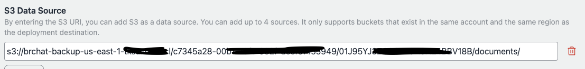

# マイグレーションガイド (v1 から v2)

## 要約

- **v1.2以前のユーザー向け**: v1.4にアップグレードし、ナレッジベース（KB）を使用してボットを再作成してください。移行期間後、すべてがKBで期待通りに動作することを確認したら、v2にアップグレードしてください。
- **v1.3のユーザー向け**: すでにKBを使用している場合でも、v1.4にアップグレードしてボットを再作成することを**強く推奨**します。pgvectorを使用している場合は、v1.4のKBを使用してボットを再作成することで移行してください。
- **pgvectorの継続使用を希望するユーザー向け**: pgvectorの使用を続ける予定の場合、v2へのアップグレードは推奨されません。v2にアップグレードするとpgvectorに関連するすべてのリソースが削除され、今後のサポートは利用できなくなります。この場合はv1を継続して使用してください。
- **v2へのアップグレードにより、Aurora関連のすべてのリソースが削除されることに注意してください。**今後の更新はv2に焦点を当て、v1は廃止されます。

## はじめに

### 何が起こるのか

v2アップデートでは、Aurora ServerlessとECSベースの埋め込みで使用されていたpgvectorを、[Amazon Bedrock ナレッジベース](https://docs.aws.amazon.com/bedrock/latest/userguide/knowledge-base.html)に置き換える大きな変更が導入されます。この変更は後方互換性がありません。

### なぜこのリポジトリがナレッジベースを採用し、pgvectorを中止したのか

この変更には、いくつかの理由があります：

#### 改善されたRAG精度

- ナレッジベースはバックエンドにOpenSearch Serverlessを使用し、フルテキストとベクター検索の両方でハイブリッド検索を可能にします。これにより、固有名詞を含む質問に対する応答の精度が向上し、pgvectorが苦手としていた部分を改善します。
- また、高度なチャンキングや解析など、RAG精度を向上させるためのより多くのオプションをサポートしています。
- ナレッジベースは2024年10月の時点で、ほぼ1年間一般提供されており、ウェブクローリングなどの機能が既に追加されています。将来的な更新が予想され、長期的に高度な機能を採用しやすくなっています。例えば、このリポジトリではpgvectorで既存のS3バケットからのインポート（頻繁にリクエストされていた機能）を実装していませんでしたが、KB（ナレッジベース）では既にサポートされています。

#### メンテナンス

- 現在のECS + Auroraの設定は、PDFの解析、ウェブクローリング、YouTubeトランスクリプトの抽出などの多数のライブラリに依存しています。対照的に、ナレッジベースのようなマネージドソリューションは、ユーザーとリポジトリ開発チームの両方にとってメンテナンスの負担を軽減します。

## マイグレーションプロセス（概要）

v1.4に移行してからv2に移動することを強くお勧めします。v1.4では、pgvectorとナレッジベースボットの両方を使用できるため、既存のpgvectorボットをナレッジベースに再作成し、期待通りに動作することを確認する移行期間を設けることができます。RAGドキュメントが同一であっても、OpenSearchのバックエンド変更により、k-NNアルゴリズムなどの違いにより、結果が若干異なる可能性があることに注意してください。ただし、一般的には類似した結果になります。

`cdk.json`で`useBedrockKnowledgeBasesForRag`を`true`に設定することで、ナレッジベースを使用してボットを作成できます。ただし、pgvectorボットは読み取り専用になり、新しいpgvectorボットの作成や編集ができなくなります。


v1.4では、[Amazon Bedrockのガードレール](https://aws.amazon.com/jp/bedrock/guardrails/)も導入されています。ナレッジベースの地域制限により、ドキュメントをアップロードするS3バケットは`bedrockRegion`と同じリージョンである必要があります。更新前に既存のドキュメントバケットをバックアップすることをお勧めします。これにより、後で大量のドキュメントを手動でアップロードする手間を省けます（S3バケットのインポート機能が利用可能です）。

## マイグレーションプロセス（詳細）

使用しているバージョンが v1.2 以前か v1.3 かによって、手順が異なります。


### v1.2 以前のユーザー向けの手順

1. **既存のドキュメントバケットをバックアップ（オプションだが推奨）。** システムが既に稼働している場合、この手順を強くお勧めします。`bedrockchatstack-documentbucketxxxx-yyyy` という名前のバケットをバックアップします。例えば、[AWS Backup](https://docs.aws.amazon.com/aws-backup/latest/devguide/s3-backups.html) を使用できます。

2. **v1.4 に更新**: 最新の v1.4 タグを取得し、`cdk.json` を変更して、デプロイします。以下の手順に従ってください：

   1. 最新のタグを取得：
      ```bash
      git fetch --tags
      git checkout tags/v1.4.0
      ```
   2. `cdk.json` を以下のように変更：
      ```json
      {
        ...,
        "useBedrockKnowledgeBasesForRag": true,
        ...
      }
      ```
   3. 変更をデプロイ：
      ```bash
      npx cdk deploy
      ```

3. **ボットの再作成**: Knowledge Base で、pgvector ボットと同じ定義（ドキュメント、チャンクサイズなど）でボットを再作成します。ドキュメントの量が多い場合、手順1のバックアップから復元すると、このプロセスが容易になります。復元には、クロスリージョンコピーの復元を使用できます。詳細は[こちら](https://docs.aws.amazon.com/aws-backup/latest/devguide/restoring-s3.html)をご覧ください。復元したバケットを指定するには、`S3 データソース`セクションを以下のように設定します。パス構造は `s3://<bucket-name>/<user-id>/<bot-id>/documents/` です。ユーザーIDは Cognito ユーザープールで、ボットIDはボット作成画面のアドレスバーで確認できます。



**Knowledge BaseではウェブクローリングやYouTubeトランスクリプトのサポートなど、一部の機能が利用できないことに注意してください（ウェブクローラーのサポートを計画中 ([issue](https://github.com/aws-samples/bedrock-claude-chat/issues/557)))。また、移行中は Aurora と Knowledge Base の両方の料金が発生することに注意してください。**

4. **公開済みAPIの削除**: VPCの削除により、v2をデプロイする前にすべての以前に公開されたAPIを再公開する必要があります。そのためには、まず既存のAPIを削除する必要があります。[管理者のAPI管理機能](../ADMINISTRATOR_ja-JP.md)を使用すると、このプロセスを簡素化できます。すべての `APIPublishmentStackXXXX` CloudFormation スタックの削除が完了すると、環境の準備が整います。

5. **v2のデプロイ**: v2のリリース後、タグ付けされたソースを取得し、以下のようにデプロイします（リリース後に可能になります）：
   ```bash
   git fetch --tags
   git checkout tags/v2.0.0
   npx cdk deploy
   ```

> [!Warning]
> v2をデプロイすると、**[サポート対象外、読み取り専用]の接頭辞が付いたすべてのボットが非表示になります。**アップグレード前に必要なボットを再作成し、アクセスの喪失を防いでください。

> [!Tip]
> スタックの更新中、「リソースハンドラーがメッセージを返しました：「サブネット 'subnet-xxx' には依存関係があり、削除できません。」のような繰り返しのメッセージが表示されることがあります。そのような場合は、管理コンソール > EC2 > ネットワークインターフェースに移動し、BedrockChatStackを検索します。表示されたインターフェースをこの名前に関連付けて削除すると、デプロイプロセスがよりスムーズになります。

### v1.3 のユーザー向けの手順

前述のように、v1.4 では、リージョンの制限により、Knowledge Base は bedrockRegion で作成する必要があります。そのため、Knowledge Base を再作成する必要があります。v1.3 で既に Knowledge Base をテストしている場合は、v1.4 で同じ定義のボットを再作成してください。v1.2 ユーザー向けの手順に従ってください。